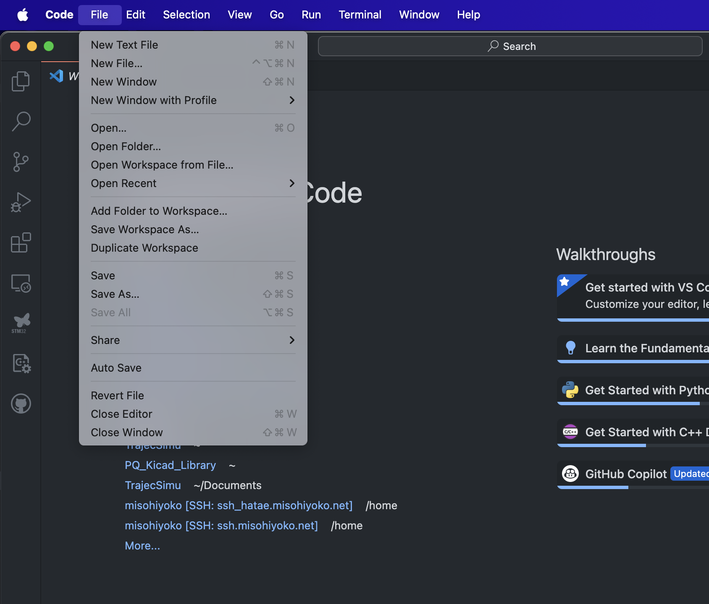

# TrajecSimu


- 今の所ruff、mypyを適応しています。設定はpyproject.tomlを参照してください
- プロジェクト管理ツールはuvです。

**以下は全て昔の説明です**

6-dof trajectory simulation for high-power rockets.  
current version: 3.0 (11/1/2018)


## 概要
6自由度飛行シミュレーションツールである[JSBSim](https://github.com/JSBSim-Team/jsbsim)を利用してロケットの飛行経路をシミュレーションします

### 入力
- ロケットのパラメータ
  - 重心、モーメントなど
  - 空力パラメータ
  - 推力履歴
- 射場パラメータ

### 出力
- 各パラメータでの飛行経路
- 飛行経路の統計情報
  - 最高速度
  - 到達高度
  - 着地地点


## 環境構築
本プロジェクトはパッケージ管理ツールとして[uv](https://github.com/astral-sh/uv)を用いています。

### uvのインストール
**Windows**
1. PowerShellを起動

2. 以下のコマンドを実行
```shell
powershell -ExecutionPolicy ByPass -c "irm https://astral.sh/uv/install.ps1 | iex"
```

**Mac**
1. ターミナルを起動
2. 以下のコマンドを実行
```shell
curl -LsSf https://astral.sh/uv/install.sh | sh
```

### プロジェクトをダウンロード
gitを用いて本リポジトリをダウンロードします。

#### VSCode系を使う場合
1. [VSCode]()をインストール
2. 起動する
3. File -> New Windowを押す

4. Clone git repositoryを押す

5. このリポジトリのURLを入力`https://github.com/PLANET-Qdeveloper/TrajecSimu`
6. ポップアップが出てきたらopenを押す

#### Gitで直接取ってくる場合
1. Gitをインストール(Github Desktopなどでも可)
2. 適切な場所で以下のコマンドを実行
```shell
git clone https://github.com/PLANET-Qdeveloper/TrajecSimu
```

### パッケージのインストール
uvが自動的に必要なパッケージをインストールします

#### VSCodeの場合
1. New Terminalでターミナルを開く

2. 画面下部のターミナルに以下を入力->Enterで実行
```shell
uv sync
```
3. 右下のポップアップでyesを押す


#### それ以外の場合
1. 適当なコンソールでダウンロードしたリポジトリのフォルダを開く
2. 以下を実行
```shell
uv sync
```

## 使い方
### 入力データ
- パラメータファイルパス
- 出力データパス


## パッケージ構造
